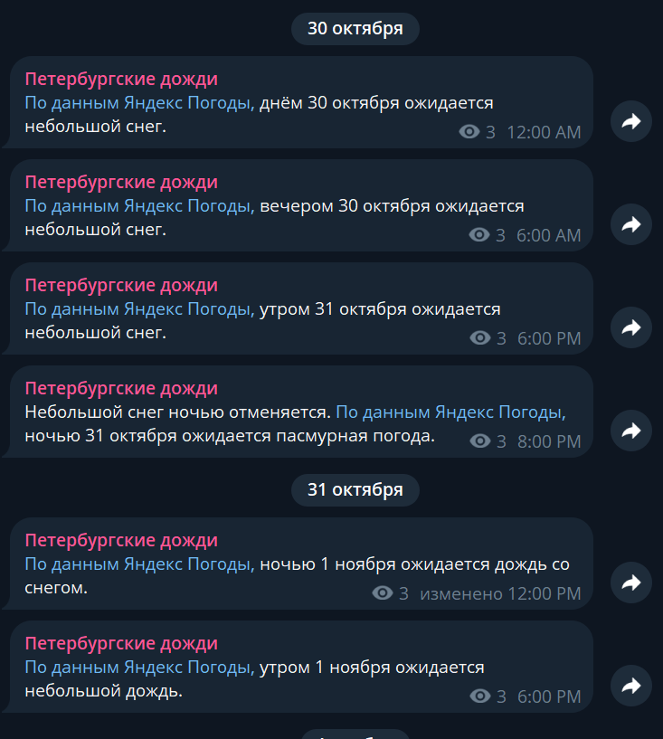

# RainBot.Channel

## О проекте

RainBot.Channel - это бот для Телеграма, который присылает уведомления о начале дождя в том или ином месте в телеграм канал.

В данный момент проект на паузе, так как я пытаюсь найти формат сообщений получше. Чтобы он не был похож на спам.

Каналы выглядят вот так:
- Московские дожди: https://t.me/moscow_rains
- Петербургские дожди: https://t.me/spb_rains

### Стек

- **C#/.NET** для всего и **Python** для deployment-скриптов
- **Serverless YDB** для хранения данных
- **Yandex Cloud Functions** для выполнения кода, **Yandex Message Queue** для взаимодействия между функциями и **API Gateway** для разграничения с внешним миром
- **Terraform** для развертывания кода в Yandex Cloud
- **GitHub Actions** для автоматического развертывания кода из репозитория в Yandex Cloud

## Как устроен бот

Проект состоит из двух функций:

- **YandexWeatherFetcher** - вызывается по крон-триггеру каждый час. Получает прогнозы от Яндекс.Погоды на следующие 12 часов и передаёт их в **forecast-handler-queue**.
- **ForecastHandler** - вызывается при помощи триггера в момент появления сообщения в очереди **forecast-handler-queue** и синхронизирует их с прогнозами из базы данных. Если среди прогнозов погоды найден дождь (или хуже), то отправляет сообщение в Телеграм-канал.
